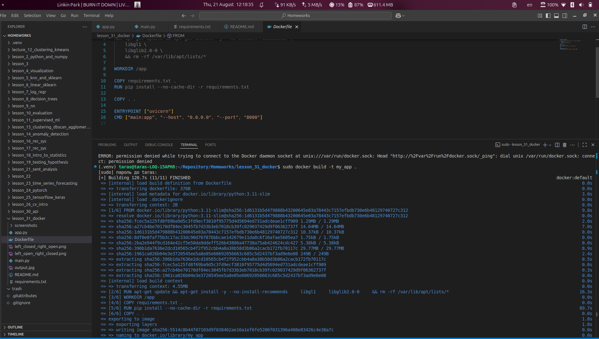
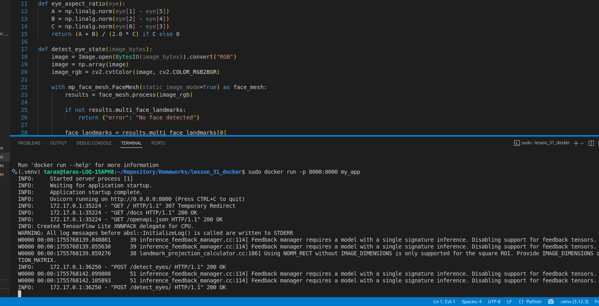
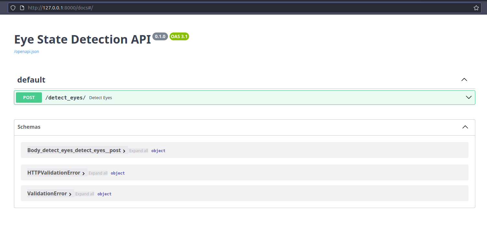
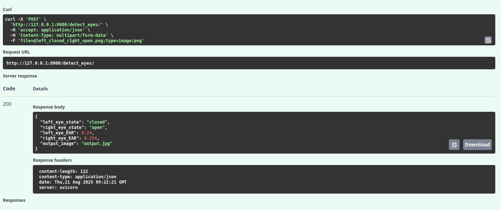

# Eye State Detection

## Запуск контейнера

### 1. Збірка Docker-образу

```bash
docker build -t my_app .
```

---

### 2. Запуск FastAPI

```bash
docker run -p 8000:8000 my_app
```

Відкриваємо в браузері:
[http://localhost:8000/docs](http://localhost:8000/docs)

---

У контейнері можна запускати інші Python-скрипти, наприклад:

```bash
docker run my_app test_app.py
```

### Скріншоти

#### Створення білда Docker



#### Запуск додатка



#### WebAPI



#### Результати виконання програми


